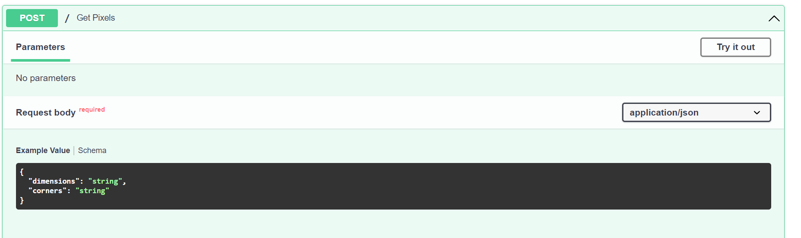

# picture_pixels
This repo is for the programming problem given for the Fetch Rewards MLE Apprenticeship application 

# How to run the program
- Clone this repo to your local computer
- Build the docker image, docker build -t myimage .
- Run the container, docker run -d --name mycontainer -p 80:80 myimage
- You can send a POST request to the backend at http://127.0.0.1/, see documentation image below, or use the index.html file to make a request after inputting the dimensions of the picture and the coordinates of the corner pixels.

# Notes/Assumptions
- From the image below in the problem statement, decimal pixel coordinates are allowed.  So when creating pixel coordinates, decimals were allowed.
- Also from the image below the coordiate (0,0) is in the bottom left.  Most images place (0,0) at the top left.  I used the coordinate system shown in the image.  Also as this seems like Cartesian coordinates, I assume negative values are acceptable for images and so did not test for negative coordinates.

# Future Improvements
- Create a CSS file to better format the front end. I was just interested in getting it to work
- In the Dockerfile, only move the necessary Python files, not copy all files to the code directory
- Add more unit tests